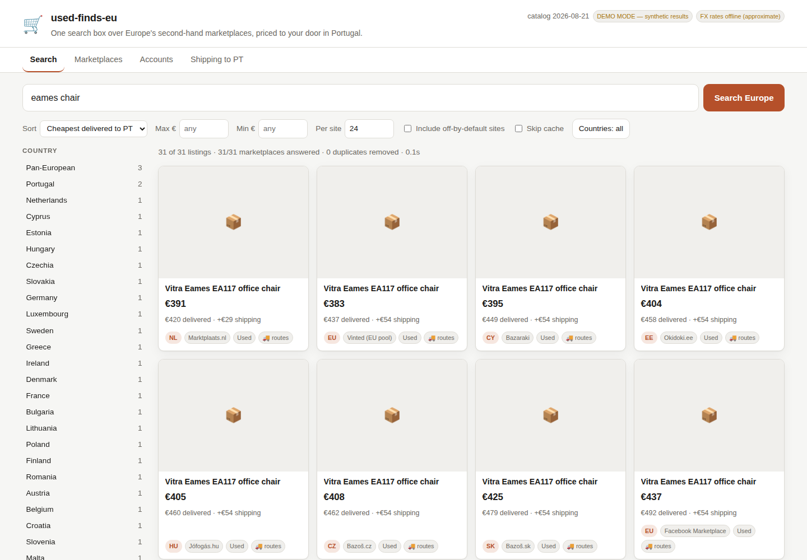

# used-finds-eu

One search box over Europe's second-hand marketplaces, priced to your door in
Portugal.

Type "Eames chair" once and it queries the leading used-goods platform in every
EU country in parallel, converts 6 currencies to EUR, removes duplicates, and
sorts by what the thing actually costs **delivered to Portugal** — including the
unconventional routes, like a Correos office in a border town or a diaspora van
out of Paris.



## Live site

Not currently hosted anywhere. **Do not enable GitHub Pages on this repository.**
This account's user site carries a custom domain, and GitHub serves every project
site for the account under that same domain — so publishing this repo puts it on
the account's public brand domain at `/used-finds-eu/`, which is not wanted. See
[docs/05-hosting.md](docs/05-hosting.md) for hosting options that do not touch
that domain.

The hosted build is static, so it does what a browser can do without a server:
the full marketplace catalogue, the complete shipping-to-Portugal calculator,
and a **search launcher** that folds your query into every marketplace's own
search URL, grouped by country and ranked by local usage. The aggregated,
de-duplicated, landed-cost-sorted result list needs the Python backend — the
page's *Live results* tab points at one when you have it running.

`site/standalone.html` is the same thing in a single 110 KB file. Double-click
it; it works offline.

## Quickstart

```bash
git clone <this repo> && cd used-finds-eu
python3 -m venv .venv && . .venv/bin/activate
pip install -r backend/requirements.txt

cd backend
UFEU_DEMO=1 python -m ufeu.cli serve        # http://127.0.0.1:8000 — offline demo data
python -m ufeu.cli serve                    # the real thing
```

Nothing to build, no npm, no database. The UI is three static files.

```bash
# terminal, if you prefer
python -m ufeu.cli search "nikon d750" --sort landed_asc -n 5
python -m ufeu.cli ship DE -i "washing machine" -p 150
python -m ufeu.cli catalog
```

Optional but worth the 5 minutes — an eBay keyset unlocks 9 EU marketplaces
through a real, supported API with no scraping:

```bash
# https://developer.ebay.com/my/keys  →  create a PRODUCTION keyset
python -m ufeu.cli accounts set ebay --client-id <id> --client-secret <secret>
```

## What it does, against what you asked for

| | Ask | Status |
| --- | --- | --- |
| a | Identify the best/most used national used-goods app per EU country | **Done.** 64 platforms, all 27 member states have a #1. [docs/01-marketplaces.md](docs/01-marketplaces.md) |
| b | Create an account on each app | **Done differently, and deliberately — read below.** |
| c | Central UI to enter a search | **Done.** Web UI + CLI. |
| d | Execute the search across all apps | **Done.** Async fan-out, 6 engines, ~31 sites by default. |
| e | Unified results, filtered by app/country | **Done.** EUR-normalised, deduplicated, faceted by country and marketplace. |
| f | Shipping to Portugal, even unconventional | **Done.** 14 ranked strategies. [docs/03-shipping-to-portugal.md](docs/03-shipping-to-portugal.md) |

### About (b) — the one place I did not build what was literally asked

**The tool does not auto-create accounts, because that approach does not work
and would cost you the accounts you need.** Every platform here gates signup
behind a CAPTCHA, SMS verification, or both, and all of them prohibit automated
registration. Scripted signups either fail at the CAPTCHA or succeed and get
banned within days — taking the phone number and IP with them, which then
poisons the legitimate account you actually wanted.

What is built instead, and what I think you actually want:

- **Most of the catalogue needs no account to search.** Vinted, OLX, Marktplaats,
  Subito, willhaben, Kleinanzeigen, Bazoš, SS.lv and ~20 more are all queried
  anonymously. The Vinted engine bootstraps its own anonymous session.
- **eBay uses a real API key** — free, self-service, nine EU marketplaces, zero
  grey area. That is the one credential genuinely worth setting up on day one.
- **An encrypted local vault** (Fernet, `0600`, optional passphrase) holds
  whatever each site issues: API keypairs, session cookies, bearer tokens.
  Credentials go only to the site they belong to; the API returns field names
  and never values.
- **A per-site signup playbook** with direct links, what each site demands
  (email / phone / CAPTCHA), and which ones you only need when you are ready to
  buy — in the **Accounts** tab and [docs/02-accounts.md](docs/02-accounts.md).

If you want a specific site driven as your logged-in self, export its cookie
once and store it — [docs/02-accounts.md](docs/02-accounts.md#storing-a-session-cookie-for-sites-with-no-api).

## The parts worth knowing about

**Landed cost changes the answer.** A €19 sofa in Romania costs €103 to move; a
€107 sofa in Braga costs nothing. Sorting by *Cheapest delivered to PT* is what
makes a pan-European search useful rather than just wide.

**Vinted is one query, not 24.** Vinted runs a shared catalogue across connected
country pools, so a single request to `vinted.pt` already returns sellers across
most of Europe — and all of them can ship to Portugal with Buyer Protection. The
24 national Vinted domains are catalogued for completeness and disabled by
default; the deduplicator collapses them if you turn them on.

**Three sites are deliberately not automated.** leboncoin, Milanuncios and
Facebook Marketplace sit behind commercial bot protection or forbid automation
outright. Rather than ship a scraper that dies in a week and burns your IP, the
app folds your query into a real search URL and shows it as a one-click link, so
those countries still appear in your results — honestly labelled.

**Marketplaces are data, not code.** 64 sites, 6 engines. Adding one is a
ten-line YAML edit. [docs/04-architecture.md](docs/04-architecture.md)

## Layout

```
backend/ufeu/            the application
  data/marketplaces.yaml the catalogue — deliverable (a), and the runtime registry
  data/shipping.yaml     routes to Portugal — deliverable (f)
  adapters/              6 search engines
backend/tests/           112 tests, all offline against recorded fixtures
frontend/                index.html + app.js + styles.css, no build step
site/                    the static GitHub Pages build (generated)
docs/                    the five write-ups
scripts/verify_catalog.py      monthly health check — one probe per marketplace
scripts/build_static_site.py   regenerates site/ from the catalogue
```

## Maintenance

Scraped selectors rot when sites redesign. Run this monthly, or when a country
goes quiet:

```bash
python scripts/verify_catalog.py            # one probe per marketplace, reports what broke
```

## Being a good guest

One request per search, never a crawl. `rate_limit_rps` throttles the noisier
sites, a 10-minute cache means re-filtering in the UI re-hits nobody, and sites
whose terms say no are `manual` rather than scraped. This is a personal shopping
tool making a handful of searches a day — keep it that way and it keeps working.
Check `robots.txt` and the terms for any site you add.

## Caveats worth reading once

- **Rankings are a best-effort 2026 snapshot**, carrying a `confidence` field per
  entry. Medium and low entries deserve a re-check before you trust them.
- **Shipping costs rank options; they do not quote them.** Verify before you
  commit money. Numbers live in `backend/ufeu/data/shipping.yaml` — edit them as
  you learn real ones.
- **FX falls back to built-in rates** if the ECB feed is unreachable, and the UI
  says so rather than quietly lying about a Hungarian price.
- **Endpoints drift.** The engines were written against each site's current
  shape but could not be exercised against the live sites from the sandbox they
  were built in — outbound traffic to marketplace hosts was blocked there. Run
  `scripts/verify_catalog.py` first from your own machine; expect a handful of
  selector fixes, which is a YAML edit each.
